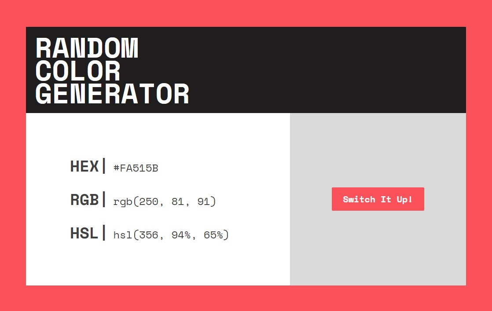

# Random Color Generator

This is a simple random color generator that allows you to generate random hex, rgb, and hsl color codes.

## Usage

To use the random color generator, simply open the index.html file in a web browser. The generator will automatically generate a new color code every time you click the "switch it up!" button.

## Features

The random color generator has the following features:

* Generates random hex, rgb, and hsl color codes
* Automatically generates a new color code every time you click the "switch it up!" button
* Copy color codes to your clipboard by clicking the generated color values

## Live Site

The live site for this project can be found [here](https://llredxll.github.io/RandomColorGenerator/)
